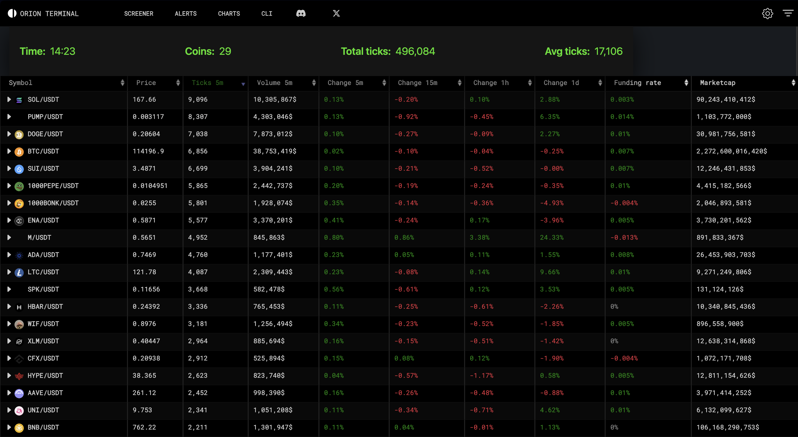

# Orion Screener Summary - Browser Extension

A lightweight Opera/Chromium browser extension that adds a live, floating summary bar to the [Orion Terminal Screener](https://orionterminal.com/screener).

Displays real-time market stats including:

- **Time** of last update  
- **Total coins** in current screener list
- **Total tick count** for `Ticks 5m` currently in screener list
- **Average ticks** of all coins currently in screener list



---

## ✨ Features

- **Auto-updates** every 5 seconds and on table changes (via `MutationObserver`)
- **Trend detection** for average ticks (green up / red down)
- **Shadow DOM isolation** to prevent site CSS conflicts
- **Centered, responsive summary bar** with adjustable size and position
- Works fully client-side — **no API keys or external services** required

---

## 🛠 Installation

### 1. Clone or download this repository

```bash
git clone https://github.com/<your-username>/orion-screener-summary.git
```

### 2. Load the extension in your browser

For Opera / Chrome / Edge (Chromium-based browsers):

1. Open the Extensions page:

   - Opera: opera://extensions
   - Chrome: chrome://extensions
   - Edge: edge://extensions

2. Enable Developer mode (toggle in the top right).
3. Click Load unpacked.
4. Select the folder containing this repo (where manifest.json is located).
5. Navigate to the Orion Screener and you should see the summary bar appear automatically.

## 📂 Project Structure

```bash
.
├── manifest.json      # Extension manifest (v3)
├── orion.js           # Main content script
├── docs/
│   └── screenshot.png # Example screenshot (replace with your own)
└── README.md          # This file
```

## ⚙ How It Works

- The extension injects a small JavaScript content script (orion.js) into the screener page.
- It looks for the #coinTable element, finds the "Ticks 5m" column, and calculates:
  - Total number of rows (coins)
  - Sum of ticks in the last 5 minutes
  - Average ticks per coin
- A floating, fixed-position summary bar is injected into the page inside a Shadow DOM for style isolation.
- The bar updates:
  - Every 5 seconds
  - Immediately when the screener table changes (via MutationObserver)

⸻

## 📜 License

This project is licensed under the MIT License.

⸻

## 🤝 Contributing

Contributions are welcome!
Feel free to submit issues or pull requests to improve functionality, styling, or add new metrics (e.g., sparklines, filtering options).
